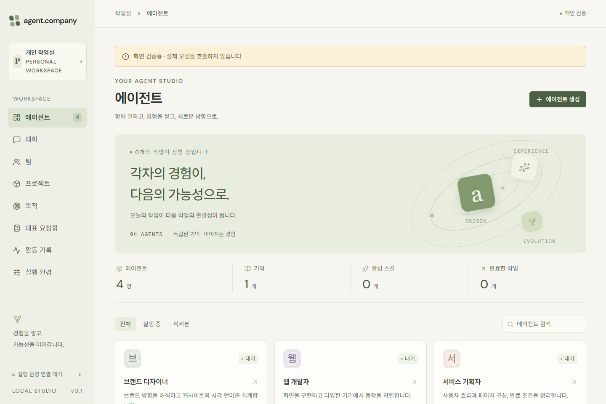
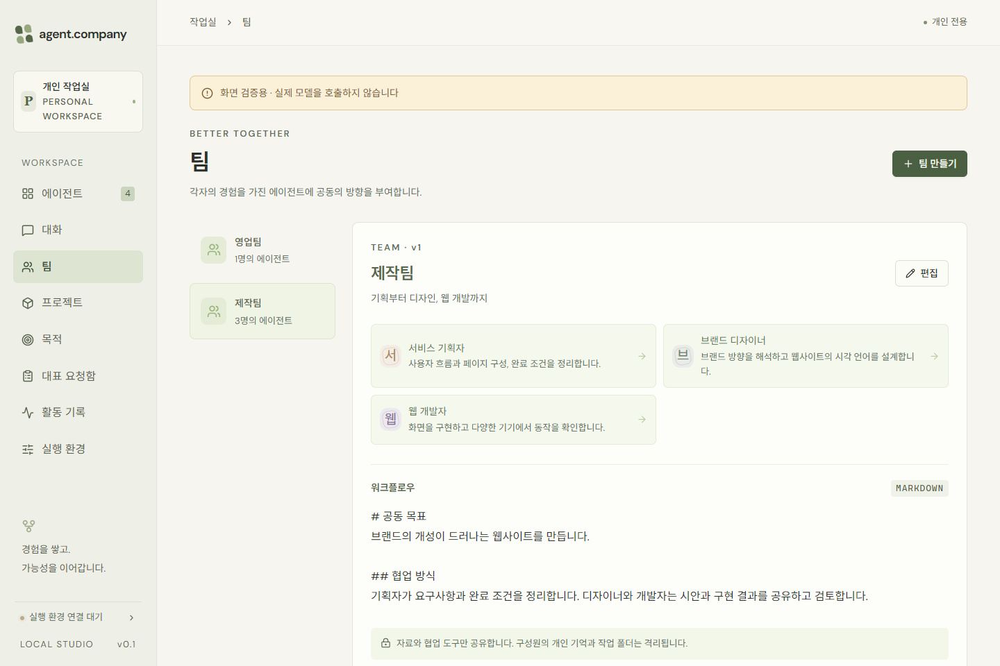
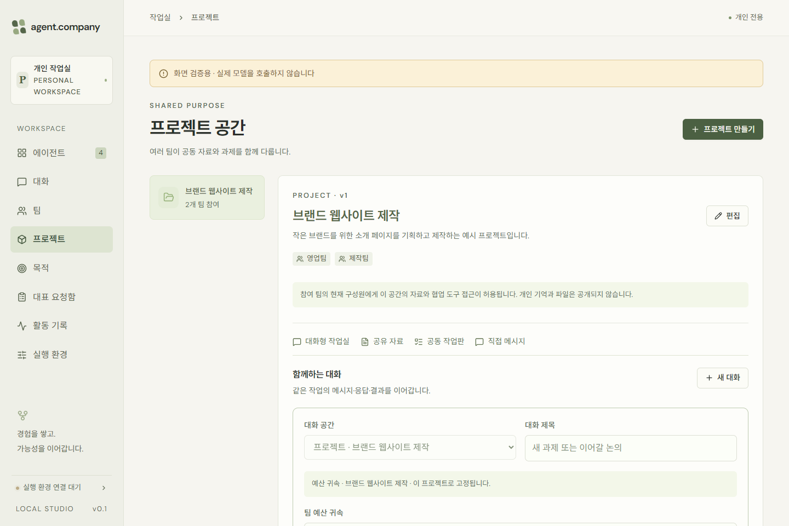
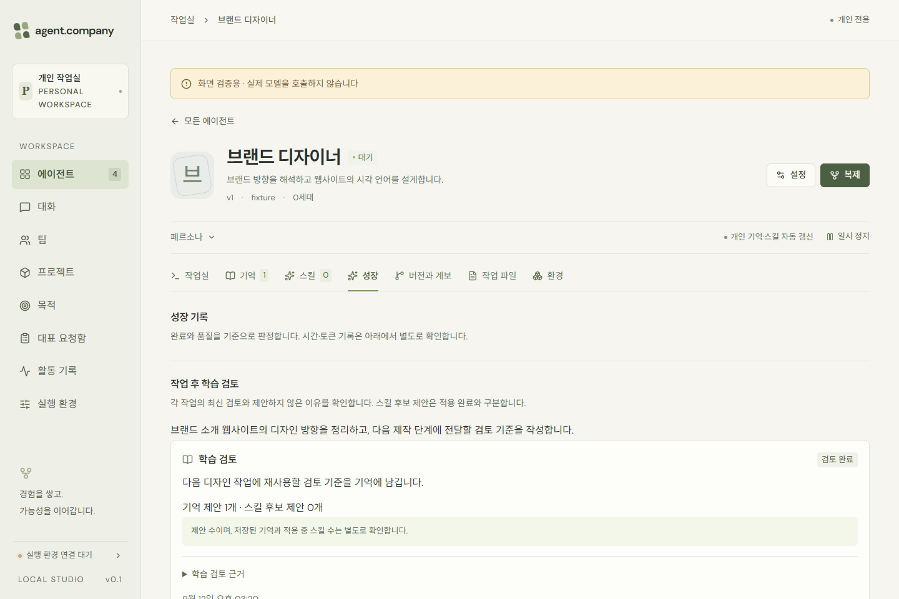

# Agent Company

내 PC에서 AI 에이전트 팀을 구성하고 업무를 진행하는 데스크톱 앱입니다.

역할과 목표를 정하고, 팀의 작업과 결과, 쌓이는 기억과 스킬을 한곳에서 관리합니다.

> 실제 앱 UI에 공개용 예시 데이터를 넣어 촬영했습니다. 아래 자료는 화면 소개이며, 실제 모델의 작업 실행 녹화가 아닙니다.

[MP4 화면 소개](media/overview.mp4) · [베타 다운로드](https://github.com/shakystar/agent-company-releases/releases) · [오류 및 개선 제안](https://github.com/shakystar/agent-company-releases/issues)

## 주요 기능

- 역할과 작업 환경을 가진 에이전트 구성
- 팀과 프로젝트 단위의 업무 관리 및 협업
- 목표 등록, 미완료 조건 검토와 후속 과제 관리
- 실행 기록과 결과물 확인
- 작업 후 학습 검토와 기억·스킬 관리

## 화면 살펴보기

### 에이전트 작업실

에이전트와 작업실 현황을 확인합니다.

### 팀 구성과 협업 방향

구성원과 워크플로우를 정하고 팀의 대화와 자료를 관리합니다.

### 프로젝트 공간

여러 팀이 같은 프로젝트에서 대화와 자료, 공동 과제를 다룹니다.

### 작업 후 학습 검토

작업에서 남길 기억과 스킬 후보, 검토 사유를 확인합니다.

## 실행 환경

- Windows 11 x64
- WSL2 및 Docker 실행 환경
- 사용자 모델 계정 연결: 현재 베타는 Codex의 ChatGPT 로그인 기반입니다.

작업에는 사용자 PC의 실행 자원과 연결한 모델 계정의 사용 한도가 적용됩니다.

## 다운로드

[Windows 베타 1 다운로드](https://github.com/shakystar/agent-company-releases/releases/tag/v0.1.0-beta.1)에서 설치 EXE와 SHA-256 검증 파일을 제공합니다.

설치 후 **실행 환경**에서 WSL2·Docker를 선택하고 필요한 실행 이미지를 설치합니다. Docker 이미지는 설치본과 분리돼 있으며 최초에만 다운로드하고 같은 버전은 재사용합니다. 두 이미지의 압축 데이터 합계는 약 989MB입니다.

X 버튼은 창을 트레이에 숨깁니다. 앱을 종료할 때는 트레이 또는 앱 메뉴의 **완전 종료**를 사용합니다. 현재 베타는 게시자 코드 서명과 자동 업데이트를 제공하지 않으며 새 버전은 수동으로 교체합니다.

[작업용 이미지](https://hub.docker.com/r/shakystar/agent-company-worker) · [브라우저용 이미지](https://hub.docker.com/r/shakystar/agent-company-browser)

## 피드백

오류와 개선 제안은 [Issues](https://github.com/shakystar/agent-company-releases/issues)에 등록할 수 있습니다. 로그와 화면에는 인증 정보와 개인 업무 내용이 포함되지 않도록 확인해 주시기 바랍니다.

## 저장소 안내

설치 파일 배포와 사용자 안내를 위한 저장소입니다. 앱 소스 코드는 현재 공개하지 않습니다.
