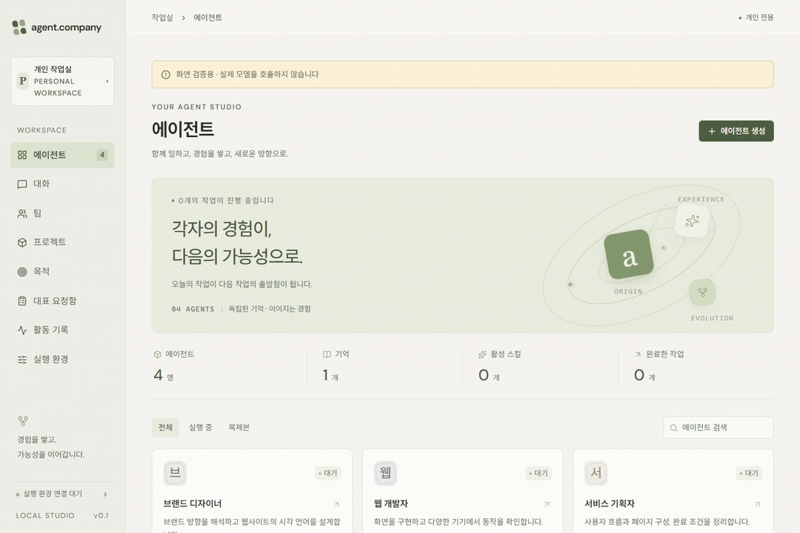

# Agent Company

내 PC에서 AI 에이전트 팀을 구성하고 업무를 진행하는 데스크톱 앱입니다.

역할과 목표를 정하고, 팀의 작업과 결과, 쌓이는 기억과 스킬을 한곳에서 관리합니다.



> 공개용 예시 데이터로 촬영한 앱 화면 소개입니다.

## 실제 사용 영상

https://github.com/user-attachments/assets/7edb25d2-3fe6-47f3-bb90-ed428b980090

> 실제 설치 앱에서 북앤코 시연 에이전트 3명과 팀·프로젝트·목적을 등록하고, 기획 에이전트의 실제 모델 응답까지 촬영했습니다. 약 2분이며 대기 구간을 줄이고 화면 일부를 확대했습니다. 자막을 추가했으며 비공개 운영 내용은 제외했습니다.

[베타 다운로드](https://github.com/shakystar/agent-company-releases/releases) · [오류 및 개선 제안](https://github.com/shakystar/agent-company-releases/issues)

## 주요 기능

- 역할과 작업 환경을 가진 에이전트 구성
- 팀과 프로젝트 단위의 업무 관리 및 협업
- 목표 등록, 미완료 조건 검토와 후속 과제 관리
- 실행 기록과 결과물 확인
- 작업 후 학습 검토와 기억·스킬 관리

## 실행 환경

- Windows 11 x64
- WSL2 및 Docker 실행 환경
- 사용자 모델 계정 연결: 현재 베타는 Codex의 ChatGPT 로그인 기반입니다.

작업에는 사용자 PC의 실행 자원과 연결한 모델 계정의 사용 한도가 적용됩니다.

## 다운로드

[Windows 베타 1 다운로드](https://github.com/shakystar/agent-company-releases/releases/tag/v0.1.0-beta.1)에서 설치 EXE와 SHA-256 검증 파일을 제공합니다.

설치 후 **실행 환경**에서 WSL2·Docker를 선택하고 필요한 실행 이미지를 설치합니다. Docker 이미지는 설치본과 분리돼 있으며 최초에만 다운로드하고 같은 버전은 재사용합니다. 두 이미지의 압축 데이터 합계는 약 989MB입니다.

X 버튼은 창을 트레이에 숨깁니다. 앱을 종료할 때는 트레이 또는 앱 메뉴의 **완전 종료**를 사용합니다. 현재 베타는 게시자 코드 서명과 자동 업데이트를 제공하지 않으며 새 버전은 수동으로 교체합니다.

[작업용 이미지](https://hub.docker.com/r/shakystar/agent-company-worker) · [브라우저용 이미지](https://hub.docker.com/r/shakystar/agent-company-browser)

## 피드백

오류와 개선 제안은 [Issues](https://github.com/shakystar/agent-company-releases/issues)에 등록할 수 있습니다. 로그와 화면에는 인증 정보와 개인 업무 내용이 포함되지 않도록 확인해 주시기 바랍니다.

## 저장소 안내

앱 소스 코드와 설치 파일을 함께 공개하는 저장소입니다. 앱 코드는 [MIT 라이선스](LICENSE)로 제공합니다. 포함된 외부 구성요소에는 각 구성요소의 라이선스와 고지가 적용됩니다.

`main`에는 개발 중인 소스가 포함됩니다. 2026-09-20 처음 게시한 소스는 현재 개발 작업 폴더의 스냅샷이며, 기존 `v0.1.0-beta.1` 설치 파일과 동일한 소스 버전으로 검증된 것은 아닙니다.

## 소스 실행

Node.js 24와 npm이 필요합니다. 저장소를 내려받은 뒤 다음 명령으로 개발 화면을 실행합니다.

```sh
npm ci
npm run dev
```

개발 화면은 `http://127.0.0.1:5173`, API는 `http://127.0.0.1:4310`입니다. 기본 `AGENT_AUTH=none`에서는 모델을 호출하지 않습니다. 실제 에이전트 작업에는 Docker와 모델 인증 설정이 필요합니다. [.env.example](.env.example)과 [개발 안내](docs/DEVELOPMENT.md)를 참고할 수 있습니다.

```sh
npm run check
```

첫 공개 소스의 검사 결과와 남은 확인 사항은 [검증 상태](docs/STATUS.md)에 기록했습니다.
